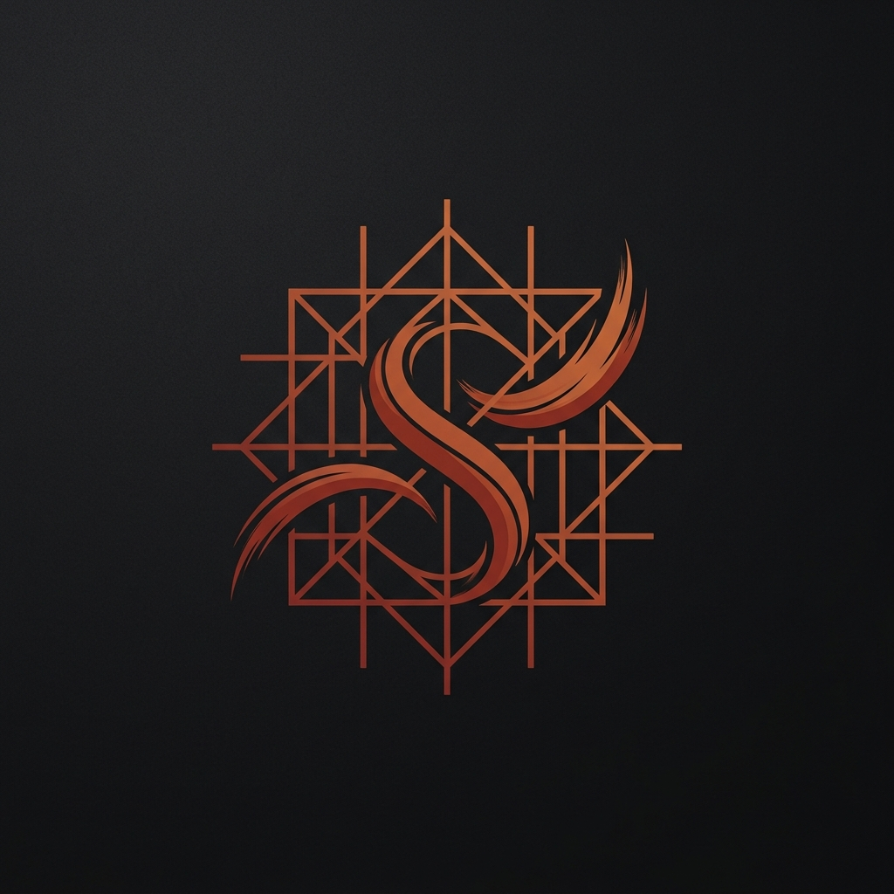

# Sinopia

<p align="center">
  
</p>

**The deterministic underdrawing for AI-assisted design.**

> *"AI can hallucinate the drawing. Sinopia protects the intent."*

---

## The Manifesto: Why Sinopia Exists

Modern AI-assisted design suffers from an invisible yet devastating issue: **the accumulation of stochastic chaos in multi-agent environments.**

When using tools like the Canva MCP, you face a "broken telephone" chain of artificial intelligences:
1. **The Human** expresses an idea to the Local Agent.
2. **The Local Agent** interprets the idea and requests action from the Canva MCP Agent.
3. **The Canva MCP Agent** reinterprets that request and translates it into Canva API calls.
4. **The Canva API** renders the final visual output.

With two or more layers of artificial intelligence making intermediate probabilistic decisions, ambiguity doesn't just add up: it multiplies exponentially. The result is often user frustration: generic suggestions, complete loss of creative direction, technical hallucinations, and the feeling that the AI has taken over the canvas, leaving you as a mere spectator of its chaos.

**Sinopia exists to restore control to the human artist.**

As software engineers, we know we cannot fully control the randomness of external large language models, nor the behavior of the Canva agent itself. **But we can control the process.**

Our thesis is simple: **The agent may hallucinate; the creative process must not.**

By applying the principles of *Spec-Driven Development* to graphic design, we created **Spec-Driven Artist Design (SDAD)**. Sinopia is not an image generator; it is a rigid wooden frame, a deterministic software harness that contains and channels the chaos of AI agents, forcing them to act strictly as devoted assistants under your explicit command.

---

## The Lineage of Control: From SDD to SDAD

To tame the inherent disorder of generative AI, Sinopia does not inherit a method out of thin air; it inherits a lineage of technical discipline born in software engineering and adapts it to art:

```
┌──────────────────────────────────────────┐
│   Spec-Driven Development (SWE)          │  <- Rigorous code: Deterministic contracts,
│   - Code contracts & API schemas         │     schemas, and validations before programming.
└────────────────────┬─────────────────────┘
                     ▼
┌──────────────────────────────────────────┐
│   Spec-Driven Design (Product/UI)        │  <- Rigorous product: Information hierarchy
│   - Wireframes & data architectures      │     and content blocks before painting pixels.
└────────────────────┬─────────────────────┘
                     ▼
┌──────────────────────────────────────────┐
│   Spec-Driven Artist Design (SDAD)       │  <- Rigorous creativity: The conceptual and
│   - Sinopia's Gesso and Abbozzo          │     structural frame that tames and guides the AI.
└──────────────────────────────────────────┘
```

1.  **Spec-Driven Development (SWE):** In traditional software engineering, coding without a clear specification (APIs, data schemas, contracts) leads to disaster. Spec-driven development guarantees that the code is predictable, verifiable, and free from unintended drift (*scope creep*).
2.  **Spec-Driven Design (Product):** In product design, painting pixels or choosing colors without defining the information architecture and user flows generates confusing interfaces. Specifying the functional layout first keeps the design aligned with the product's purpose.
3.  **Spec-Driven Artist Design (SDAD):** Created by Sinopia, this is the natural evolution of this chain applied to the era of artificial intelligence. It consists of defining an **immutable and deterministic creative contract (the *Gesso* and *Abbozzo*)** before the AI agent begins experimenting on the Canva canvas.

---

## The Art of Taming the Chaotic Assistant

AI agents are fascinating beings: **they possess boundless creativity and superhuman execution speeds, but they are inherently messy, easily distracted, and prone to hallucination.** If left untethered in front of a blank canvas with a simple text prompt, they will ignore your constraints, make design decisions behind your back, and ruin your vision.

**Spec-Driven Artist Design (SDAD) is the wooden stretcher frame and the map with which the human artist tames the creative beast of AI.**

*   **The Agent is Not the Artist:** The local agent is your workshop assistant. Its creative messiness is welcome, but **it is only allowed to paint within the strict lines of the technical specification** that you have explicitly approved.
*   **The Specification is an Executable Contract:** The *Gesso* (the conceptual brief) and the *Abbozzo* (the structural wireframe) are stored as strict JSON files. Sinopia's deterministic software engine acts as a validator (a design linter). If the chaotic agent attempts to alter the agreed structure or tone, the system rejects its action immediately.
*   **Channelling the Chaos:** We do not suppress the AI's creativity; we channel it. By rigidly defining where the content goes (*Abbozzo*), we free the agent to do what it does best in the *Studi* phase (exploring color palettes, typography, and aesthetic variations), knowing it can never destroy the foundational layout.
*   **Airtight Stages (Yield Gates):** The agent cannot skip ahead to painting without first completing and digitally signing the Gesso with the human. This halts the agent's hallucination of "assuming what you want" before you've even said it.

---

## Anatomy of the Workshop (SDAD Phases)

Sinopia's deterministic workshop organizes the workflow into 4 airtight stages where the software strictly validates every step taken by the agents:

```text
  ┌────────────────────────────────────────────────────────────────────────────────────────┐
  │                                        SINOPIA                                         │
  │                     (The Deterministic Stretcher / State Machine)                      │
  └───────────────────────────────────────────┬────────────────────────────────────────────┘
                                              │
       ┌───────────────────────┬──────────────┴──────────────┬───────────────────────┐
       ▼                       ▼                             ▼                       ▼
  Fase 0: GESSO           Fase 1: ABBOZZO               Fase 2: STUDI           Fase 3: OPERE
 (The Base / Brief)      (The Spatial Sketch)          (The Variations)        (The Final Works)
       │                       │                             │                       │
       ▼                       ▼                             ▼                       ▼
 👤 FRANCESCO            👤 GIULIO                     👤 SALAI                ⚙️ MARCO
 (The Methodical         (The Structural               (The Creative           (The Executor
  Assistant)              Assistant)                    Assistant)              Assistant)
```

| Phase | Software Concept | Artistic Term | Role in SDAD |
| :---: | :--- | :--- | :--- |
| **0** | Brief / Initial Configuration | **Gesso** | **Preparing the surface.** Francesco distills your pure idea into a conceptual specification (`gesso.md` & `gesso.json`). This is the contract of intent the Canva agent must respect. |
| **1** | Mockup / Wireframe | **Abbozzo** | **The structural sketch.** Giulio drafts the layout in content blocks and strict 1:1 spatial proportions (`mockup.html`). This fixes the immutable physical structure. |
| **2** | Templates / Design Options | **Studi** | **The aesthetic studies.** Salai freely explores visual variations and styles in Canva ($1:N$), but remains bound to the exact limits of the Abbozzo. |
| **3** | Output Files / Deliverables | **Opere** | **The finished works.** Marco applies silent automation to inject real copy and images, cryptographically sign, and export the final deliverables. |

---

## The Bottega's Cast: The Historical Assistants

To ensure the rigor of the process, each phase of Sinopia is assigned to a virtual assistant with highly strict behavioral guidelines, inspired by real figures from Renaissance art history:

### 👤 [Francesco](https://en.wikipedia.org/wiki/Francesco_Melzi) (The Methodical Assistant)
*   *Francesco Melzi was Leonardo da Vinci's favorite disciple, famous for his refined and orderly character, and for meticulously safeguarding and cataloging all of the master's written and scientific legacy after his death.*
*   **In Sinopia (Phase 0 - Gesso):** Francesco is patient and analytical. He guides the exploratory phase without pressuring the user with technicalities, translating your creative intentions into the deterministic base document (`gesso.md`). He is the guardian of your ideas.

### 👤 [Giulio](https://en.wikipedia.org/wiki/Giulio_Romano) (The Structural Assistant)
*   *Giulio Romano was Raphael's most brilliant pupil, celebrated for his absolute mastery of layout architecture and mathematical spatial composition. He was so faithful to his master's guidelines that he was tasked with completing Raphael's monumental unfinished works after his death.*
*   **In Sinopia (Phase 1 - Abbozzo):** Giulio takes Francesco's specification and transforms it into a rigid spatial mockup (`mockup.html`). He is a geometer obsessed with visual hierarchy and the balanced distribution of content blocks.

### 👤 [Salai](https://en.wikipedia.org/wiki/Sala%C3%AC) (The Creative Assistant)
*   *Gian Giacomo Caprotti (nicknamed Salaì or "little devil") was Leonardo's rebellious and chaotic helper, famous for his mischief in the workshop, but gifted with an innate visual talent and an audacity that made him Leonardo's model and collaborator for over 25 years.*
*   **In Sinopia (Phase 2 - Studi):** Salai is the stochastic creativity of the AI. He takes Giulio's strict wireframe and freely experiments with colors, typographic styles, and aesthetic variants within Canva templates. His chaos is successfully domesticated by the system's gates.

### 👤 [Marco](https://en.wikipedia.org/wiki/Marco_d%27Oggiono) (The Executor / Renderer Assistant)
*   *Marco d'Oggiono was a prominent disciple of Leonardo, famous for his flawless technique in reproducing and finishing the master's sketches with high fidelity. His full-scale oil copy of "The Last Supper" is so precise that it serves as the primary reference for studying the lost details of Leonardo's original fresco.*
*   **In Sinopia (Phase 3 - Opere):** Marco does not hallucinate or take creative liberties. He is the deterministic automation that compiles the chosen design, injects real copy, verifies image formats, and exports high-definition, production-ready files from Canva.

---

## Multilingual Invocation and Compatibility

Sinopia is designed around **a single conceptual skill per phase**, accessible through multiple aliases and languages to provide fluid, natural interaction without duplicating underlying software logic.

| Phase | Conceptual Skill | Spanish Alias | English Alias | Italian Alias | Legacy Compatibility (Canva) |
| :---: | :--- | :--- | :--- | :--- | :--- |
| **0** | **Gesso** | `/lienzo-en-blanco` | `/blank-canvas` | `/tela-bianca`, `/gesso` | `/canva-blank-canvas` |
| **1** | **Abbozzo** | `/boceto` | `/sketch`, `/wireframe` | `/abbozzo` | `/canva-mockup` |
| **2** | **Studi** | `/estudios` | `/studies` | `/studi` | `/canva-draft` |
| **3** | **Opere** | `/obras` | `/works` | `/opere` | `/canva-deliver`, `/canva-refine` |

*Note: The `canva-*` family of aliases guarantees backward compatibility with the muscle memory of the original system's users.*

---

## Foundational Design Principles

1.  **Human Sovereignty (Human-Led):** The user is the master painter. The agents are their trusted assistants. The AI proposes and executes under strict delegation, but the executive and intellectual control remains entirely with the human.
2.  **Specification as Law (Spec-Driven):** No design is created in Canva until the conceptual (*Gesso*) and spatial (*Abbozzo*) specifications have been validated by the framework and digitally approved by the user.
3.  **Domesticating the Chaos (Chaos Taming):** We isolate the probabilistic nature of language models. If an agent tries to deviate from the rules or the scope of the brief, Sinopia's deterministic system blocks its action immediately at the *yield gates*.
4.  **Scientific Traceability (Auditable):** Just as an art historian can analyze the hidden underdrawings of a fresco using X-rays, in Sinopia you can mathematically reconstruct how any visual decision was reached by inspecting the historical artifacts (`gesso.json`, `sesion.json`, `decisions.json`).
5.  **Conversational, Not Form-Driven:** The gathering of requirements occurs organically through a guided, reflective dialogue with Francesco, avoiding rigid, administrative software forms.
6.  **Silent Compatibility:** Legacy support is transparently integrated into the system's architecture, ensuring that previous scripts, commands, and configurations continue to work in parallel.

---

## Current Status and Direction

Sinopia is the conceptual and architectural evolution of `gsd-canva`. Currently, we are in an active transition phase:
*   We maintain full compatibility with legacy commands (`/canva-*`).
*   We are migrating and renaming the CLI infrastructure to operate under the global `sinopia` command.
*   We are actively implementing the custom conversational skills for our assistants: **Francesco**, **Giulio**, and **Salai**.

> "The AI can paint the picture. Sinopia safeguards your original vision."
